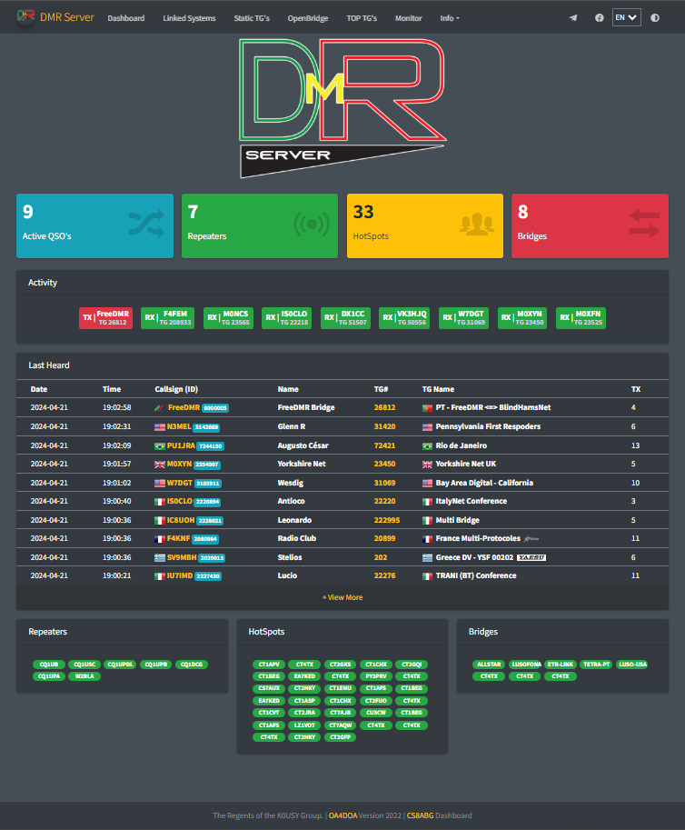

**Dashboard with Self Service for FreeDMR Servers**



***This version has been forked from FDMR Monitor with Self Service by OA4DOA.***


## Changes to the Dashboard

**This branch has exactly the same features as the main branch, including Self Service.**

*** 2023/07/29 ***
- Added new flags.
- Introduced a new stanza called `DASHBOARD` in the configuration file(fdmr-mon.cfg).
- Users can now customize the dashboard settings using the `DASHBOARD` stanza.
- Display country flag before callsign in the lastheard table.
- Added power, latitude, longitude, and height in repeater/hotspot descriptions.
- Improved layout: Boxes and tables now hide when no repeaters, hotspots, or bridges are present.

*** 2023/70/23 ***
- The dashboard is now fully responsive and adapts to different screen sizes and devices.
- Users can now switch between dark and light mode for a more comfortable viewing experience.
- The dashboard now supports multiple languages, making it more accessible to users around the world.
- The main page of the dashboard now displays the number of active QSOs, connected repeaters, hotspots, and bridges.
- An new options calculator has been integrated into the dashboard for easy use.

## Flags:
***Flags have been introduced to add visual indicators for Talkgroups (TG) or DMR IDs. To enable flags for specific TGs or DMR IDs, follow these steps:***

- If you see the world flag flickering in the `lastheard`, `Linked systems`, etc. tables, you need to add or copy a new flag image in the `flags` folder.
- The flag image should be named with the first three digits of the Talkgroup or DMR ID.
- For example, if the Talkgroup is 12345678, place a file called `123.png` in the `flags` folder.

## Repeaters, Hotspots, and Bridges:
***The dashboard now distinguishes between Repeaters, Hotspots, and Bridges based on their DMR IDs and/or TX/RX frequency.***

- If a DMR ID has 6 digits, it is considered a Repeater and will be displayed in the `Repeaters` table.
- If a DMR ID has 7 digits or more and has a TX/RX frequency associated with it, it is recognized as a Hotspot and will be shown in the `Hotspots` table.
- If a DMR ID has 7 digits or more and has a TX/RX frequency of 0 (zero), it is identified as a Bridge and will appear in the `Bridges` table.

## Install Instructions

FDMR Monitor has been tested on Debian v10 and v11

This version of FDMR Monitor requires a LAMP (Linux, Apache, MySQL, PHP) installation there are
some good tutorials on the internet that will help you with the installation.

Self Service has been tested with:
- Debian v10, v11
- Apache 2.4.53 (Debian)
- MariaDB 15.1 Distrib 10.5.15-MariaDB
- PHP 7.4.28

The install.sh file has been improved, now it will guide you throug the installation process, please 
be prepeard with the next information to make the installation easier:
- The location of your web server root folder:
  If you are using Apache2 web server it usually is:
  - /var/www/html/

- The location of FreeDMR folder:
  The script will create a new branch named Self_Service and copy the content of the proxy file into 
  it, the location usually is:
  - /opt/FreeDMR

- Database information:
  This information is neccesary for the database connection, you will need to provide the next 
  items:
  - Database username
  - Database password
  - Database name

```
  cd /opt  
  sudo git clone https://github.com/CS8ABG/FDMR-Monitor.git  
  cd FDMR-Monitor  
  sudo git checkout Self_Service  
  sudo chmod +x install.sh  
  sudo ./install.sh  
  
  Now you can configure the theme color and name for your Dashboard from the config.cfg file, you  
  can also define the height of the Server Activity window: 45 1 row, 60 2 rows, 80 3 rows:  
  HEIGHT_ACTIVITY = 45
  
  If you set TGCOUNT_INC to True the button will be added automatically
  If you want to modify or add any other button you will find a buttons.php file in the root of your
  web server.  
  
  If you make any modification to the configuartion file please restart fdmr_mon.service:  
  - sudo systemctl restart fdmr_mon  
  
  You can replace the logo with an image of your preference in the img/ directory img/logo.png  
    
  - You can start, stop, or restart with the next commands:
    sudo systemctl start fdmr_mon
    sudo systemctl stop fdmr_mon
    sudo systemctl restart fdmr_mon

  forward TCP port 9000 and web server port in firewall
      
  I recommend that you do not use the BRIDGE_INC = True option to display bridge information 
  (if you have multiple bridges displaying this information will increase the CPU load, 
  try to use BRIDGES_INC = False in config.py) 
  
  If for any reason you want to reset the database to the original values:
  sudo systemctl stop fdmr_mon
  sudo rm mon.db
  sudo python3 mon_db.py
  sudo systemct start fdmr_mon
```

---

**FDMR Monitor by OA4DOA**

FDMR Monitor for FreeDMR Servera based on HBMonv2 https://github.com/yuvelq/FDMR-Monitor 

---

**HBMonv2 by SP2ONG**

HBMonitor v2 for DMR Server based on HBlink/FreeDMR https://github.com/sp2ong/HBMonv2 

---

**hbmonitor3 by KC1AWV**

Python 3 implementation of N0MJS HBmonitor for HBlink https://github.com/kc1awv/hbmonitor3 

---

Copyright (C) 2013-2018  Cortney T. Buffington, N0MJS <n0mjs@me.com>

This program is free software; you can redistribute it and/or modify it under the terms of the GNU General Public License as published by the Free Software Foundation; either version 3 of 
the License, or (at your option) any later version.

This program is distributed in the hope that it will be useful, but WITHOUT ANY WARRANTY; without even the implied warranty of MERCHANTABILITY or FITNESS FOR A PARTICULAR PURPOSE. See the 
GNU General Public License for more details.

You should have received a copy of the GNU General Public License along with this program; if not, write to the Free Software Foundation, Inc., 51 Franklin Street, Fifth Floor, Boston, MA 
02110-1301  USA

---
